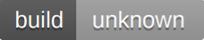

# commonmark  
[](https://nodesource.com/products/nsolid)

[](https://travis-ci.org/joemccann/commonmark)

commonmark is a cloud-enabled, mobile-ready, offline-storage, AngularJS powered HTML5
Markdown editor.

- Type some Markdown on the left
- See HTML in the right
- Magic


# New Features!
- Import a HTML file and watch it magically convert to Markdown
- Drag and drop images (requires your Dropbox account be linked)

You can also:

- Import and save files from GitHub, Dropbox, Google Drive and One Drive
- Drag and drop markdown and HTML files into commonmark
- Export documents as Markdown, HTML and PDF

Markdown is a lightweight markup language based on the formatting conventions that
people naturally use in email. As [John Gruber](https://daringfireball.net/) writes on the [Markdown site](https://daringfireball.net/projects/markdown/)

> The overriding design goal for Markdown's formatting syntax is to make it as
readable as possible. The idea is that a Markdown-formatted document should be
publishable as-is, as plain text, without looking like it's been marked up with
tags or formatting instructions.

This text you see here is actually written in Markdown! To get a feel for Markdown's
syntax, type some text into the left window and watch the results in the right.


#### Tech

commonmark uses a number of open source projects to work properly:

- [AngularJS](https://angularjs.org/) - HTML enhanced for web apps!
- [Ace Editor](http://ace.ajax.org/) - awesome web-based text editor
- [markdown-it]( ) - Markdown parser done right. Fast and easy to extend.
- [Twitter Bootstrap]( ) - great UI boilerplate for modern web apps
- [node.js]( ) - evented I/O for the backend
- [Express]( ) - fast node.js network app framework [@tjholowaychuk]()
- [Gulp]( ) - the streaming build system
- [Breakdance]( ) - HTML to Markdown converter
- [jQuery]( ) - duh

And of course commonmark itself is open source with a [public repository]() on GitHub.


#### Installation

commonmark requires [Node.js]() v4+ to run.

Install the dependencies and devDependencies and start the server.

```bash
$ cd commonmark
$ npm install -d
$ node app
```
```bash
For production environments...
$ npm install --production
$ NODE_ENV=production node app
```
#### Plugins
commonmark is currently extended with the following plugins. Instructions on how to
use them in your own application are linked below.

| Plugin | README |
| -- | -- |
|  Dropbox | [plugin/dropbox/README.md]() |
| GitHub |  [plugin/GitHub/README.md]() |
|Google Drive|  [plugin/googledrive/README.md]() |
| OneDrive |  [plugin/onedrive/README.md]() |
| Medium |  [plugin/medium/README.md]() |
|Google Analytics |  [plugin/googleanalytics/README.md]() |


#### Development

Want to contribute? Great!

commonmark uses Gulp + Webpack for fast developing. Make a change in your file and
instantaneously see your updates!

Open your favorite Terminal and run these commands.

First Tab:

```bash 
$ node app
```

Second Tab:

```bash 
$ gulp watch
```

(optinial) Third:

```bash 
$ karma test
```

##### Building for source

For production release:

```bash 
$ gulp build --prod

```
Generating pre-built zip archives for distribution:

```bash 
$ gulp build dist --prod

```

#### Docker

commonmark is very easy to install and deploy in a Docker container.
By default, the Docker will expose port 8080, so change this within the Dockerfile if
necessary. When ready, simply use the Dockerfile to build the image.

```bash
cd commonmark
docker build -t joemccann/commonmark:${package.json.version}
```


This will create the commonmark image and pull in the necessary dependencies. Be sure
to swap out ``` ${package.json.version} ``` with the actual version of commonmark

Once done, run the Docker image and map the port to whatever you wish on your host. In
this example, we simply map port 8000 of the host to port 8080 of the Docker (or
whatever port was exposed in the Dockerfile):


Verify the deployment by navigating to your server address in your preferred browser.

```bash 
127.0.0.1:8000
``` 

###### Kubernetes + Google Cloud

See [KUBERNETES.md]()

##### Todos

- Write MORE Tests
- Add Night Mode

### License

MIT

**Free Software, Hell Yeah!**
